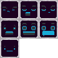

# GIMP Spritesheet Exporter plugin
GIMP plugin (Python-fu) to export TextureAtlas spritesheet from multiple layers.

## Howto:
* Only visible layers will be exported
* Layers with name in brackets are used as a background for every sprite
* File > Export Spritesheet
* Select output directory
* Spritesheet .png and .xml metadata will be exported (filename same as GIMP file).
* All sprites need to be the same size
* Sprites will be ordered to form a square, roughly

## Example input:


## Example output:


```
<TextureAtlas imagePath='spritesheet.png'>
  <SubTexture name='shifty' x='0' y='0' width='32' height='32'/>
  <SubTexture name='hey' x='32' y='0' width='32' height='32'/>
  <SubTexture name='suspicious' x='64' y='0' width='32' height='32'/>
  <SubTexture name='scared' x='0' y='32' width='32' height='32'/>
  <SubTexture name='excited' x='32' y='32' width='32' height='32'/>
  <SubTexture name='wow' x='64' y='32' width='32' height='32'/>
  <SubTexture name='normal' x='0' y='64' width='32' height='32'/>
</TextureAtlas>
```

## Unity import:

Use [XML Texture Atlas Slicer](https://assetstore.unity.com/packages/tools/utilities/xml-texture-atlas-slicer-36103) 
to automatically slice spritesheet into individual named sprites.

